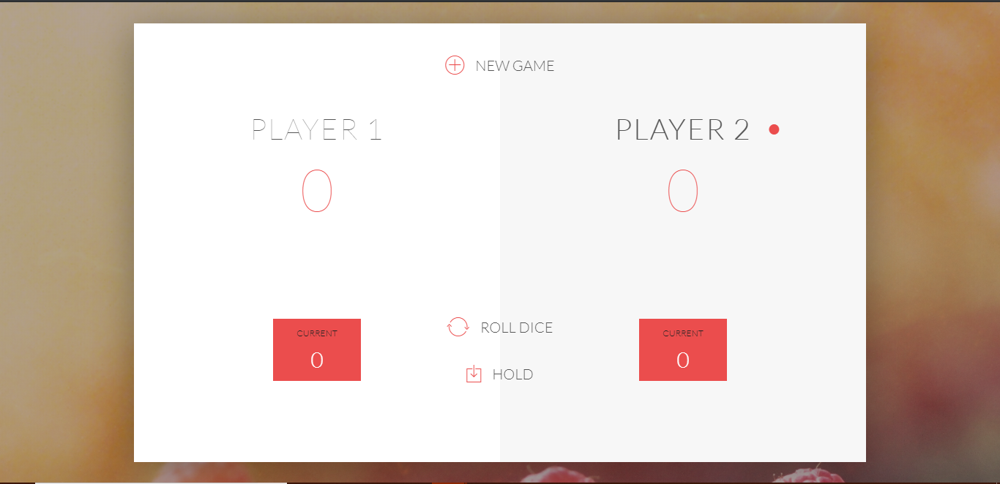
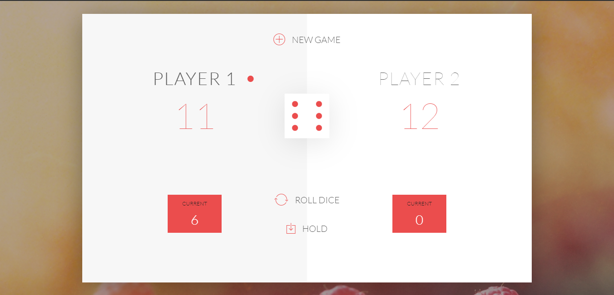
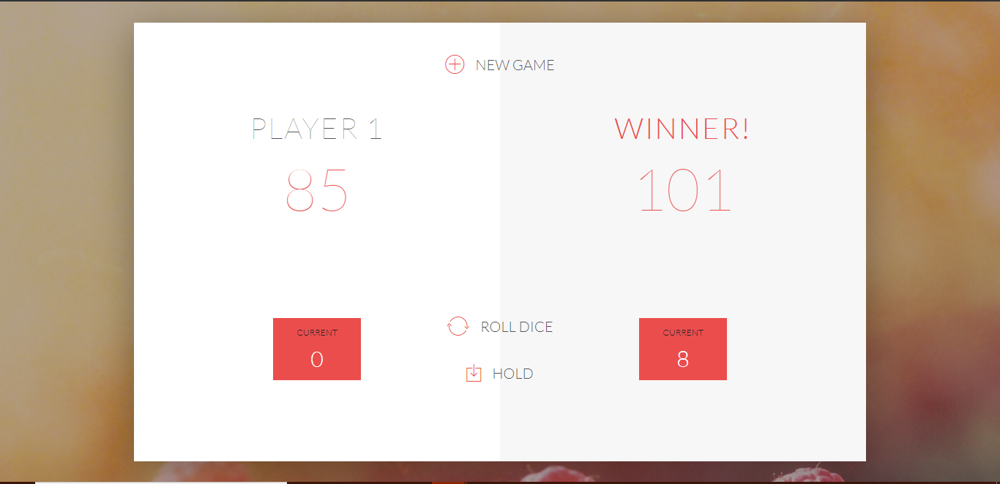

# Pig Game

## GAME RULES:

- The game has 2 players, playing in rounds
- In each turn, a player rolls a dice as many times as he whishes. Each result get added to his ROUND score
- BUT, if the player rolls a 1, all his ROUND score gets lost. After that, it's the next player's turn
- The player can choose to 'Hold', which means that his ROUND score gets added to his GLBAL score. After that, it's the next player's turn
- The first player to reach 100 points on GLOBAL score wins the game

## What I learnt -

- Manipulation of DOM
- Generation of a random number(Math functions basically)
- Reading from the DOM
- Changing CSS styles through Javascript (style, toggle , add, remove classes)
- Using state variables to store the state of the game
- DRY(Do not Repeat Yourself) principle by using functions

## Screenshots of the game -
  
</img>
  
</img>
  
</img>

## Play the game here -
https://thepiggame.netlify.com/
  

