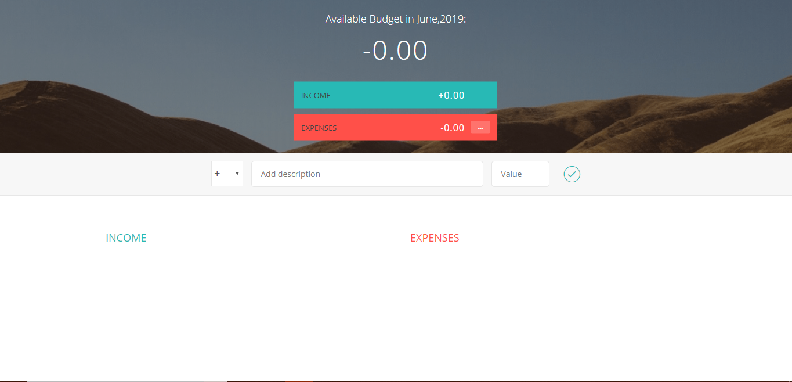
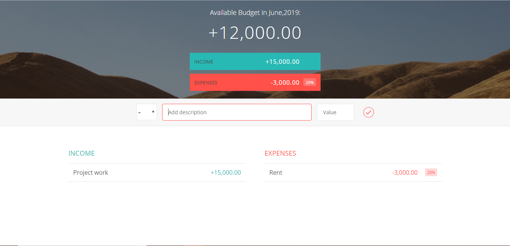

# The Budget Tracker App

## Objective:

- Keeps track of the income and expenses.
- Keeps track of the budget total.
- Calculates the total expense percentage and the individual expense.

## What I learnt -

* Modules - creation,public and private methods and properties, seperation of concerns
 * keypress events,keycodes
 * reading data from different html input types
 * storing hardcoded strings(such as classnames) in objects, and accessing them through the object in the entire app
 * Initialization function - so the module contains only functions
 * How to choose relevant function constructors
 * How to setup proper data structure for our program
 * How to add big chunks of html into the dom
 * How to replace parts of string
 * DOM manipulation using the insertAdjacentHtml method
 * Clearing Html feilds
 * using querySelectorAll
 * Converting list to an array
 * foreach loop
 * Convert input feilds to numbers, prevent false inputs
 * Event delgation in practice
 * How to use Id's in html to connect the ui with data model
 * How to use the parentNode property for Dom traversing
 * Looping over an array through map
 * Remove elements from an array using the splice method
 * creating forEach function for nodeLists
 * getting the current date through Date object constructor
 * the change event

## Screenshots of the app -
  
</img>
  
</img>
  

## Checkout the app here -
https://thebudgetapp.netlify.com
  

